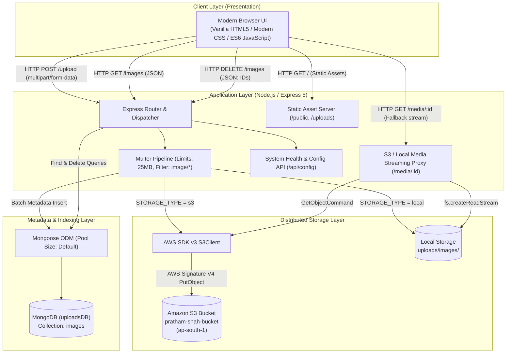
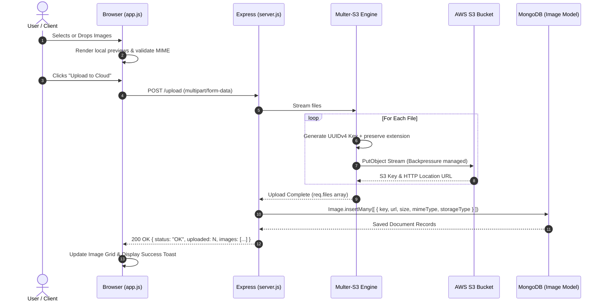
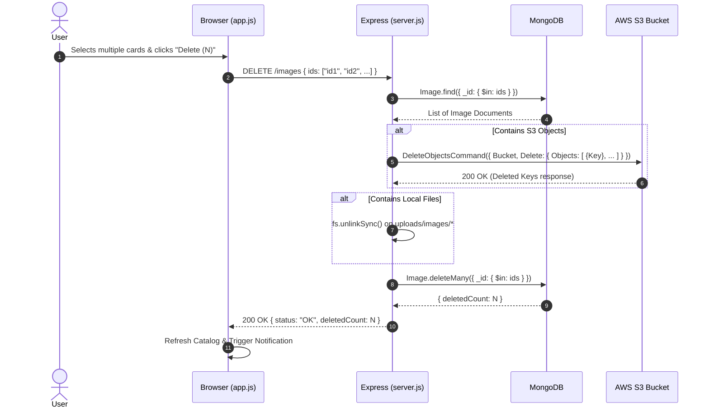

# System Architecture & Technical Design Document
## Cloud Media Hub: Unified AWS S3 & MongoDB Distributed Media Storage

---

## 1. Executive Summary

**Cloud Media Hub** is a distributed, high-performance media upload and asset management service. It pairs **Amazon Simple Storage Service (AWS S3)** as an elastic, high-durability object storage engine with **MongoDB** as an indexing and metadata catalog, orchestrated by an **Express.js (Node.js)** backend and a responsive, glassmorphic client interface.

This document details the architectural justification, High-Level Design (HLD), Low-Level Design (LLD), API contracts, and trade-off analysis.

---

## 2. Architectural Justifications & Trade-Off Analysis

### 2.1 Why Decouple Binary Storage (S3) from Metadata (MongoDB)?

A foundational design question in media-intensive applications is whether to store binary assets directly within the database (e.g., MongoDB BSON or GridFS), on the application server's local disk, or in a dedicated cloud object store.

```
┌─────────────────────────────────────────────────────────────────────────┐
│                      Separation of Concerns Pattern                     │
├────────────────────────────────────┬────────────────────────────────────┤
│         AWS S3 (Blob Store)        │        MongoDB (Metadata DB)       │
├────────────────────────────────────┼────────────────────────────────────┤
│ • Raw binary payloads (PNG, JPG)   │ • Asset IDs, filenames, MIME types │
│ • 99.999999999% (11 9's) durability│ • File size, storage engine tag    │
│ • Unlimited horizontal scaling     │ • Fast indexes, filters, sorting   │
│ • Direct CDN/CloudFront delivery   │ • Full audit timestamps            │
└────────────────────────────────────┴────────────────────────────────────┘
```

#### Comparison Matrix

| Evaluation Criteria | Approach A: Local Disk Only | Approach B: MongoDB GridFS (Blob in DB) | Approach C: AWS S3 + MongoDB (Our Choice) |
| :--- | :--- | :--- | :--- |
| **Scalability** | ❌ Bounded by host disk size; cannot scale horizontally across pods. | ⚠️ Database size balloons rapidly; expensive RAM allocated to WiredTiger cache for binary chunks. | ✅ **Virtually infinite storage**; scale storage independently of compute. |
| **Stateless Servers** | ❌ Server instances become stateful; autoscaling or pod restarts risk data loss. | ✅ Stateless app servers, but database cluster becomes bloated. | ✅ **100% Stateless app servers**; easily deployed to ECS, EKS, or Lambda. |
| **Query Performance** | ❌ Requires file system traversal or external index. | ⚠️ Good, but chunked binary documents pollute working memory set. | ✅ **Sub-millisecond metadata queries**; indexes remain compact in RAM. |
| **Cost Efficiency** | ⚠️ Expensive block storage (EBS / NVMe) required for high capacity. | ❌ High database compute, storage, and backup licensing costs for raw blobs. | ✅ **Ultra-low cost tiers** (S3 Standard / Intelligent-Tiering / Glacier). |
| **CDN Integration** | ⚠️ Complex caching layers on custom web servers. | ❌ Cannot directly front GridFS with AWS CloudFront natively. | ✅ **Native edge caching** via AWS CloudFront with zero backend load. |
| **Durability** | ⚠️ Subject to disk corruption, single-AZ EBS failures. | ⚠️ Dependent on replica set volume management. | ✅ **11 9's durability (99.999999999%)** redundant across 3+ availability zones. |

---

### 2.2 Why Stream Uploads via `multer-s3` (Zero-Buffer Streaming)?

#### The Problem of In-Memory Buffering
When handling concurrent multi-file uploads (e.g., 20 files of 25MB each), accumulating files in Node.js memory buffers (`multer.memoryStorage()`) quickly exhausts the V8 heap (default ~1.4GB–4GB), triggering `JavaScript heap out of memory` crashes and event-loop lag.

#### The Streaming Pipeline Solution
```
Client Request ──► [HTTP Multipart Stream] 
                         │
                         ▼
             [Multer Transform Stream]
                         │
                         ▼
           [AWS S3 PutObject / Multipart Stream] ──► AWS S3 Bucket
                         │
        (Upload Complete Signal & Location)
                         │
                         ▼
        [MongoDB Batch Insert Image.insertMany()]
```

- **Backpressure Handling**: Data chunks are piped directly from incoming network sockets to AWS S3 using AWS SDK v3 streaming. Server memory consumption remains $O(1)$ relative to file size.
- **Atomic Database Commit**: MongoDB document creation occurs strictly *after* S3 acknowledges receipt of all files, preventing orphaned DB records when network drops occur mid-upload.

---

### 2.3 Why Provide the Fallback Streaming Proxy (`GET /media/:id`)?

Direct S3 bucket URLs (e.g., `https://bucket.s3.region.amazonaws.com/key`) often fail in private corporate networks or locked-down buckets due to:
1. Strict S3 **Block Public Access (BPA)** settings.
2. Cross-Origin Resource Sharing (**CORS**) restrictions when loading from web interfaces.
3. Lack of ACL grants on specific objects.

**The Solution**:
Our architecture provides dual access:
- **Direct S3 URL**: For public buckets or CDN-fronted assets.
- **Reverse Streaming Proxy (`/media/:id`)**: Uses the backend's IAM credentials to execute `GetObjectCommand` and stream the S3 body directly to the HTTP response with correct `Content-Type`. If the client cannot load the direct S3 URL, the UI automatically falls back to `/media/:id`.

---

### 2.4 Why Implement a Dual-Mode Storage Switch (`s3` vs `local`)?

The architecture uses an environment toggle:
```bash
STORAGE_TYPE=s3    # Production / Cloud mode
STORAGE_TYPE=local # Local development / Offline CI test mode
```
- **Developer Experience (DX)**: Developers can clone the repository, run `STORAGE_TYPE=local npm start`, and build frontend/backend features locally without needing active AWS IAM credentials or an internet connection.
- **CI/CD Pipelines**: Automated pull request checks can run against local storage without risking cloud expenses or AWS credential leaks.

---

## 3. High-Level Design (HLD)

### 3.1 System Architecture Diagram



---

### 3.2 Ingestion & Retrieval Workflows

#### A. Multi-File Upload Workflow


#### B. Batch Deletion Workflow


---

## 4. Low-Level Design (LLD)

### 4.1 Data Model Specification (`Models/Image.js`)

#### Schema Definition
```javascript
const ImageSchema = new Schema(
  {
    key:          { type: String, required: true, index: true },
    url:          { type: String, required: true },
    filePath:     { type: String }, // Legacy compatibility
    originalName: { type: String, default: "Unnamed" },
    mimeType:     { type: String, default: "image/jpeg" },
    size:         { type: Number, default: 0 },
    storageType:  { type: String, enum: ["s3", "local"], default: "s3" }
  },
  {
    timestamps: true // Adds createdAt and updatedAt
  }
);
```

#### Data Dictionary

| Field | Type | Required | Index | Description | Example |
| :--- | :--- | :---: | :---: | :--- | :--- |
| `_id` | `ObjectId` | Yes | Primary | Unique document identifier in MongoDB. | `6a9ec76a8163b82fa451facb` |
| `key` | `String` | Yes | Yes (B-Tree)| S3 Object Key or local file basename. Key index optimizes fast lookup during deletions. | `3ff69115-ac6b-4ef9-b98a-606bdf55b94f.png` |
| `url` | `String` | Yes | No | Public direct URL or relative asset path. | `https://pratham-shah-bucket.s3.ap-south-1.amazonaws.com/...` |
| `filePath` | `String` | No | No | Backwards-compatibility alias populated automatically via pre-save hook. | Same as `url` |
| `originalName` | `String` | No | No | Human-readable original filename before UUID assignment. | `vacation_photo.png` |
| `mimeType` | `String` | No | No | Content-Type header value. | `image/png`, `image/webp` |
| `size` | `Number` | No | No | Size in bytes for quota monitoring and UI formatting. | `1458291` |
| `storageType` | `String` | Yes | No | Storage backend: `'s3'` or `'local'`. | `'s3'` |
| `createdAt` | `ISODate` | Auto | No | Creation timestamp used for sorting catalog newest-first. | `2026-09-07T14:17:14.695Z` |
| `updatedAt` | `ISODate` | Auto | No | Last update timestamp. | `2026-09-07T14:17:14.695Z` |

---

### 4.2 REST API Interface Contracts

#### 1. Upload Media
- **Endpoint**: `POST /upload`
- **Content-Type**: `multipart/form-data`
- **Max Files**: 20 files per batch
- **Max File Size**: 25 MB per file
- **Request Parameters**:
  - `avatar`: Array of binary image files.

**Response `200 OK` (JSON)**:
```json
{
  "status": "OK",
  "uploaded": 1,
  "images": [
    {
      "_id": "6a9ec76a8163b82fa451facb",
      "key": "3ff69115-ac6b-4ef9-b98a-606bdf55b94f.png",
      "url": "https://pratham-shah-bucket.s3.ap-south-1.amazonaws.com/3ff69115-ac6b-4ef9-b98a-606bdf55b94f.png",
      "originalName": "test.png",
      "mimeType": "image/png",
      "size": 70,
      "storageType": "s3",
      "createdAt": "2026-09-07T14:17:14.695Z",
      "updatedAt": "2026-09-07T14:17:14.695Z"
    }
  ]
}
```

---

#### 2. Get Media Catalog
- **Endpoint**: `GET /images` (alias: `GET /api/images`)
- **Query Params**: None
- **Response `200 OK`**:
```json
{
  "status": "OK",
  "images": [ /* Array of Image objects sorted by createdAt descending */ ]
}
```

---

#### 3. Stream Media (Direct/Fallback)
- **Endpoint**: `GET /media/:id`
- **Description**: Streams the image directly from S3 (via `GetObjectCommand`) or local disk, setting appropriate `Content-Type`.
- **Response Headers**:
  - `Content-Type`: e.g. `image/png`
  - `Connection`: `keep-alive`

---

#### 4. Batch Delete Media
- **Endpoint**: `DELETE /images` (alias: `DELETE /api/images`)
- **Content-Type**: `application/json`
- **Request Payload**:
```json
{
  "ids": ["6a9ec76a8163b82fa451facb", "695234f2e75a1e4a2649d3c6"]
}
```
- **Response `200 OK`**:
```json
{
  "status": "OK",
  "message": "2 image(s) deleted successfully",
  "deletedCount": 2
}
```

---

#### 5. System Health & Configuration
- **Endpoint**: `GET /api/config`
- **Response `200 OK`**:
```json
{
  "status": "OK",
  "storageType": "s3",
  "bucket": "pratham-shah-bucket",
  "region": "ap-south-1",
  "mongoConnected": true
}
```

---

## 5. Security & Reliability Architecture

```
┌────────────────────────────────────────────────────────────────────────┐
│                        Security Boundary Layers                        │
├──────────────────┬───────────────────┬─────────────────────────────────┤
│ Edge Layer       │ Application Layer │ Cloud Storage Layer             │
├──────────────────┼───────────────────┼─────────────────────────────────┤
│ • MIME filtering │ • .env isolation  │ • AWS Signature Version 4       │
│ • 25MB limits    │ • .gitignore rule │ • Zero public write access      │
│ • Sanitized UUID │ • Safe unlinking  │ • IAM Least-Privilege policy    │
└──────────────────┴───────────────────┴─────────────────────────────────┘
```

1. **Credential Protection**: AWS IAM keys are loaded strictly via `dotenv` into process memory and excluded from source control using `.gitignore`.
2. **File Injection Defense**: User filenames are never stored directly on the file system or S3 root. All stored keys are strictly UUIDv4 identifiers (`uuidv4() + path.extname(file.originalname)`), completely mitigating path traversal (`../`) and file overwrite attacks.
3. **MIME Whitelisting**: Multer enforces `fileFilter` rejecting non-image MIME types before upload streams begin.
4. **Idempotent Deletions**: Deletion logic handles missing files gracefully (if a file was already removed from S3 or disk, DB deletion still completes cleanly without unhandled exceptions).

---

## 6. Directory Structure & File Map

```
AWS-S3/
├── .env                  # Private runtime environment variables (git-ignored)
├── .env.example          # Public documentation template for environment setup
├── .gitignore            # Protects secrets, node_modules, and uploads directory
├── ARCHITECTURE.md       # Full System Architecture, HLD, and LLD documentation
├── package.json          # ES Module configuration and project dependencies
├── server.js             # Unified Express application, S3/disk engine, REST APIs
├── server-upload.js      # Reference legacy local-storage server implementation
├── s3-upload.js          # Reference legacy AWS S3 script
├── Models/
│   └── Image.js          # Mongoose Image schema with extended metadata fields
├── public/
│   ├── index.html        # Modern responsive client dashboard
│   ├── style.css         # Glassmorphic CSS design system and tokens
│   └── app.js            # Client controller: drag-and-drop, AJAX, toasts, lightbox
└── uploads/
    └── images/           # Fallback local disk directory for offline storage
```

---

## 7. Future Scalability Roadmap (Production Enhancements)

1. **AWS CloudFront CDN**:
   - Point CloudFront distribution to `pratham-shah-bucket.s3.ap-south-1.amazonaws.com`.
   - Update `Image.url` to store CDN edge endpoints, reducing latency to <30ms globally.
2. **Direct Browser-to-S3 Presigned Post (Zero Server Bandwidth)**:
   - For ultra-high traffic (>10,000 concurrent uploads), implement `@aws-sdk/s3-presigned-post`. The client queries `/api/presigned-url`, receives a cryptographically signed S3 POST policy, and uploads directly from browser to S3, bypassing server memory and bandwidth entirely.
3. **Image Transformation Pipeline**:
   - Connect AWS S3 `ObjectCreated` events to **AWS Lambda** to automatically generate responsive WebP thumbnails (128x128, 512x512, 1024x1024) asynchronously.
4. **Authenticated File Uploads & Secure Downloads (AuthN / AuthZ Roadmap)**:
   - **User Identity & Multi-Tenancy**:
     - Integrate JWT / OAuth2 / AWS Cognito session authentication.
     - Associate media records with user accounts by adding `userId` to `ImageSchema`:
       ```javascript
       userId: { type: Schema.Types.ObjectId, ref: 'User', required: true, index: true },
       visibility: { type: String, enum: ['private', 'shared', 'public'], default: 'private' },
       sharedWith: [{ type: Schema.Types.ObjectId, ref: 'User' }]
       ```
     - **Tenant-Isolated S3 Key Partitioning**:
       Prefix keys by user ID: `users/${req.user.id}/${uuidv4()}${ext}` to enable fine-grained AWS IAM bucket policy restrictions per user/tenant.
   - **Secure Authenticated Downloads via S3 Presigned URLs**:
     - Instead of public bucket access, keep the bucket strictly **private** (`BlockPublicAccess = true`).
     - When an authenticated user requests an image, the backend verifies ownership (`image.userId.equals(req.user.id)` or `sharedWith.includes(req.user.id)`).
     - Generate a cryptographically signed, short-lived S3 Presigned URL using `@aws-sdk/s3-request-presigner`:
       ```javascript
       import { getSignedUrl } from "@aws-sdk/s3-request-presigner";
       import { GetObjectCommand } from "@aws-sdk/client-s3";

       const presignedUrl = await getSignedUrl(
         s3Client,
         new GetObjectCommand({ Bucket: S3_BUCKET_NAME, Key: image.key }),
         { expiresIn: 900 } // Valid for 15 minutes
       );
       ```
     - The browser downloads directly from S3, ensuring zero unauthorized access while offloading 100% of bandwidth from the Express server.
   - **Fine-Grained Quota Management**:
     - Track cumulative storage consumption per user in MongoDB (`totalStorageUsedBytes`).
     - Middleware rejects uploads before piping to S3 if user exceeds tier storage limits (e.g., 5GB free tier).

